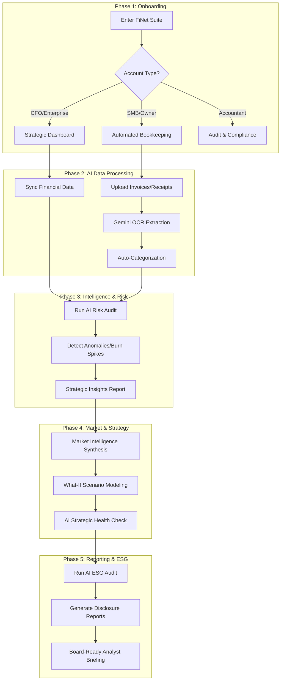

# FiNet AI Strategic Finance: User Journey

This document outlines the professional user journey for CFOs, SMB owners, and Accounting firms using the FiNet AI Suite.

## 🗺️ High-Level User Journey Diagram

---

## 👨‍💼 User Persona Journeys

### 1. The Strategic CFO (Niche: Large Co's)
*   **Goal**: Maximize runway and detect strategic risks.
*   **Journey**:
    1.  Logs into **Executive Insights** to check MRR/Churn velocity and runs a **Strategic Health Check**.
    2.  Uses **Market Intelligence** to synthesize news (e.g., Inflation spikes) into a **CFO Analyst Briefing**.
    3.  Runs the **Risk Discovery** dashboard to identify high-priority price drifts or unregistered vendor risks.
    4.  Simulates growth scenarios in the **What-If Sandbox** to determine feasibility of Q4 expansion.

### 2. The SMB Owner (Niche: Small Businesses)
*   **Goal**: Save time on manual entry and manage cash flow.
*   **Journey**:
    1.  Uploads a batch of invoices to **Data Extraction** for instant Gemini OCR processing.
    2.  Reviews AI-extracted vendor data and confirms the auto-categorization into the **General Ledger**.
    3.  Checks the **Real-time Burn Chart** on the dashboard to ensure runway is within safety limits.
    4.  Monitors the **Subscription Banner** to ensure premium AI credits are available for the month.

### 3. The Professional Accountant (Niche: Bookkeeping Firms)
*   **Goal**: Handle 5x more clients through automation.
*   **Journey**:
    1.  Monitors the **Continuous Close** status and anomaly feeds across multiple client profiles.
    2.  Uses **Sustainability Reporting** to calculate carbon footprints and perform **AI ESG Audits** for clients.
    3.  Manages client team permissions in **Workspace Settings**, assigning **Auditor** roles for external reviews.
    4.  Generates board-ready **Disclosure Reports** and exports verified **CSV/PDF files** for tax preparation.
    5.  Utilizes the **Market Sentiment Heatmap** to advise clients on sector-specific financial strategies.
