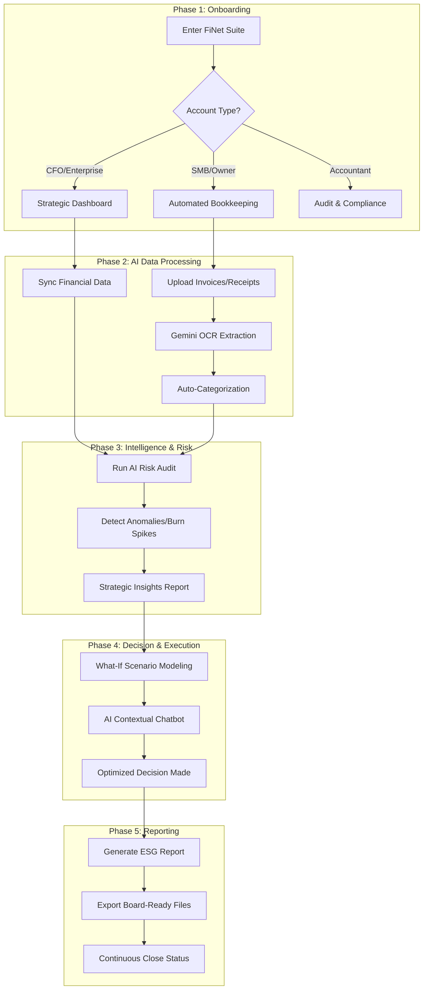

# FiNet AI Strategic Finance: User Journey

This document outlines the professional user journey for CFOs, SMB owners, and Accounting firms using the FiNet AI Suite.

## 🗺️ High-Level User Journey Diagram

---

## 👨‍💼 User Persona Journeys

### 1. The Strategic CFO (Niche: Large Co's)
*   **Goal**: Maximize runway and detect strategic risks.
*   **Journey**:
    1.  Logs into **Executive Insights** to check MRR/Churn velocity.
    2.  Uses **Scenario Planning** to simulate the impact of a 15% revenue drop.
    3.  Runs the **Risk Audit** to identify department-level burn anomalies.
    4.  Queries **FiNet AI Chat** for a real-time runway prediction based on the new scenario.

### 2. The SMB Owner (Niche: Small Businesses)
*   **Goal**: Save time on manual entry and manage cash flow.
*   **Journey**:
    1.  Uploads a batch of invoices to **Data Extraction**.
    2.  Reviews AI-extracted vendor data and confirms the auto-categorization.
    3.  Navigates to **Reconciliation** to approve 98% of automatically matched bank transactions.
    4.  Checks the **Subscription Banner** to monitor trial status before upgrading to Pro.

### 3. The Professional Accountant (Niche: Bookkeeping Firms)
*   **Goal**: Handle 5x more clients through automation.
*   **Journey**:
    1.  Monitors the **Continuous Close** status across multiple client profiles.
    2.  Uses **Audit Discovery** (Benford's Law) to perform deep-dive spot checks on high-risk transactions.
    3.  Generates a **Workiva-style ESG report** for regulatory compliance.
    4.  Exports a verified **Board-Ready File** for the end-of-quarter review.
